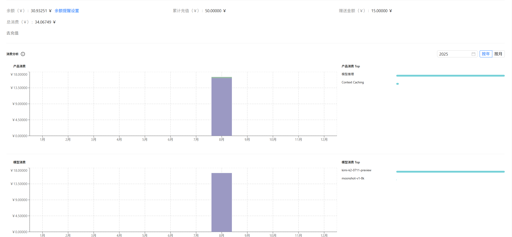

# 雅思单词 GPT Dictionary 

本项目基于 [Ceelog/DictionaryByGPT4](https://github.com/Ceelog/DictionaryByGPT4) 开发，旨在自动化生成雅思词汇的 GPT 风格词典。通过对比 GPTDictionary 与雅思单词表，筛选出未收录的雅思词汇，并利用 Kimi v2 接口批量获得高质量的解释内容，最终构建出适用于雅思备考的智能词典。

## 项目特色

- **差异对比**：自动筛选 GPTDictionary 和雅思单词表的差异，精准定位未覆盖词汇。
- **高质量解释**：调用 Kimi v2 模型，生成详细且优质的单词解释，包括词义、例句、词根词缀分析等。
- **批量自动处理**：支持 CSV 与 JSONL 格式输入输出，便于大规模词汇处理和结果归档。
- **开放源码**：代码结构清晰，便于自定义和扩展。

## 使用方法

### 1. 数据准备

- 准备雅思单词表（如 `words_clean.csv`），格式：每行一个单词及简要内容。
- 准备已有的 GPTDictionary 结果（如 `gptwords.json`），每行一个 JSON 对象，包含 `word` 和 `content` 字段。

### 2. 匹配与筛选

运行 `match.py`，将未被 GPTDictionary 收录的雅思词汇输出为 `unmatched.csv`，已匹配的输出至 `matched.json`。

### 3. 批量生成解释

运行 `batch_process.py`，自动读取 `unmatched.csv`，通过 Kimi v2 批量生成解释，并将结果追加写入 `output_words.jsonl`。

支持参数自定义：

- `timeout`：单词解释超时时间（默认 60 秒）
- `rate`：请求间隔（默认 1 秒）

### 4. 结果归档

最终所有雅思词汇的 GPT 风格解释会整合在 JSONL 文件中，便于后续查阅或导入其他学习工具。

### 5. 导入Anki
直接导入Output文件夹中的 .tsv 或者 .apkg。

## 主要依赖

- Python 3.x
- [Kimi v2 接口](https://kimi.moonshot.cn/)
- CSV/JSON 处理库

## 核心代码结构

- `match.py`：词表差异比对，输出未匹配单词
- `batch_process.py`：自动化批量解释生成
- `kimiv2.py`：Kimi v2 封装接口
- `gptwords.json`、`words_clean.csv`、`output_words.jsonl` 等数据文件

## 示例流程

```shell
python match.py  # 生成 unmatched.csv
python batch_process.py  # 批量生成解释，输出 output_words.jsonl
```

## 致谢

- [Ceelog/DictionaryByGPT4](https://github.com/Ceelog/DictionaryByGPT4) 为本项目提供了基础框架和思路。
- 感谢 Kimi v2 提供高质量词义生成能力。

---

如需详细用法或遇到问题，请提交 Issue 或联系作者。

---
### 总共花费30块 电脑跑了两天两夜才做完, 忘记写多线程是这样的 - -|||
