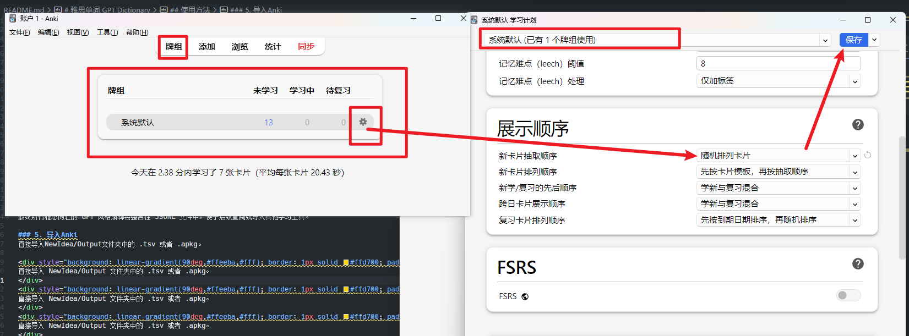
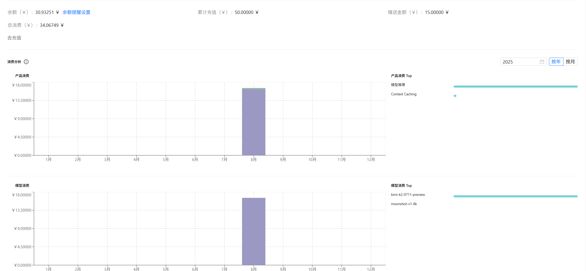

# 雅思单词 GPT Dictionary 

> ⚠️ **Output 文件夹说明**  
> **`main/Output/` 和 `output/` 文件夹包含所有最终输出内容：**
> - `IELTS_anki_words.tsv` - Anki导入用TSV文件
> - `IELTS_final_output.jsonl` - 最终处理结果JSONL文件  
> - `IELTS_gpt_dictionary.apkg` - 可直接导入的Anki包

本项目基于 [Ceelog/DictionaryByGPT4](https://github.com/Ceelog/DictionaryByGPT4) 开发，旨在自动化生成雅思词汇的 GPT 风格词典。通过对比 GPTDictionary 与雅思单词表，筛选出未收录的雅思词汇，并利用 Kimi v2 接口批量获得高质量的解释内容，最终构建出适用于雅思备考的智能词典。

## 项目特色

- **差异对比**：自动筛选 GPTDictionary 和雅思单词表的差异，精准定位未覆盖词汇。
- **高质量解释**：调用 Kimi v2 模型，生成详细且优质的单词解释，包括词义、例句、词根词缀分析等。
- **批量自动处理**：支持 CSV 与 JSONL 格式输入输出，便于大规模词汇处理和结果归档。
- **多线程高效处理**：支持多线程并发API调用，可自定义最大并发数，极大提升处理速度。
- **线程安全保护**：文件读写操作均有线程锁保护，确保数据完整性。
- **完整工作流**：从词汇对比到最终Anki包生成的全流程自动化。
- **开放源码**：代码结构清晰，便于自定义和扩展。

## 使用方法

### 1. 数据准备

- 准备雅思单词表（根目录下的 `words_clean.csv` 或雅思词汇CSV文件），格式：每行一个单词及简要内容。
- 准备已有的 GPTDictionary 结果（如 `main/gptwords.json`），每行一个 JSON 对象，包含 `word` 和 `content` 字段。

### 2. 匹配与筛选

进入 `main` 目录，运行 `1_compare_words.py`，将未被 GPTDictionary 收录的雅思词汇输出为 `unmatched.csv`，已匹配的输出至 `matched.json`。

```shell
cd main
python 1_compare_words.py
```

### 3. 批量生成解释

**推荐：多线程高效处理（新版）**

```shell
# 多线程批量处理，支持自定义并发数和延迟
python 2_batch_process_MultiThread.py --csv unmatched.csv --output output_words.jsonl --workers 8 --delay 0.3
```

参数说明：
- `--csv`：输入CSV文件路径
- `--output`：输出JSONL文件路径
- `--workers`：最大并发线程数（建议1-10，根据API限制调整）
- `--delay`：每个请求间隔秒数（防止触发API限流）

**单线程处理（兼容旧版）**

```shell
# 单线程处理
python 2_batch_process.py
```

### 4. 数据处理与格式化

```shell
# 格式化处理结果
python 3_formatter.py

# 合并数据
python 4_merge.py

# 转换为Anki格式
python 5_AnkiConvert.py
```

### 5. 结果归档

最终所有雅思词汇的 GPT 风格解释会整合在 JSONL 文件中，并自动生成Anki导入文件，所有结果保存在 `Output/` 文件夹中：
- `IELTS_final_output.jsonl`：完整的词汇解释数据
- `IELTS_anki_words.tsv`：Anki导入用TSV格式
- `IELTS_gpt_dictionary.apkg`：可直接导入的Anki包

### 6. 导入Anki

**方式一：直接导入Anki包**
- 双击 `main/Output/IELTS_gpt_dictionary.apkg` 或 `output/IELTS_gpt_dictionary.apkg`

**方式二：手动导入TSV文件**
- 在Anki中选择导入，选择 `main/Output/IELTS_anki_words.tsv` 或 `output/IELTS_anki_words.tsv`

#### 随机卡牌



## 主要依赖

- Python 3.x
- [Kimi v2 接口](https://kimi.moonshot.cn/)
- openai (用于Kimi API调用)
- requests
- threading (多线程支持)
- CSV/JSON 处理库

安装依赖：
```shell
cd main
pip install -r requirements.txt
```

## 核心代码结构

### 根目录文件
- `words_clean.csv`：清理后的雅思单词表
- `雅思*.csv`：原始雅思词汇数据文件
- `MergeCSV.py`：CSV文件合并工具

### main/ 目录（主要处理脚本）
- `1_compare_words.py`：词表差异比对，输出未匹配单词
- `2_batch_process.py`：单线程批量解释生成（兼容版）
- `2_batch_process_MultiThread.py`：多线程批量解释生成（推荐）
- `3_formatter.py`：结果格式化处理
- `4_merge.py`：数据合并
- `5_AnkiConvert.py`：Anki格式转换
- `kimiv2_SingleThread.py`：单线程Kimi API封装
- `kimiv2_MultiThread.py`：多线程Kimi API封装
- `config.py`：配置文件（API密钥、线程参数等）
- `test_multithread.py`：多线程功能测试

### 数据文件
- `main/gptwords.json`：已有GPT词典数据
- `main/words_clean.csv`：处理用词汇表
- `main/unmatched.csv`：未匹配词汇
- `main/output_words.jsonl`：批量处理结果

### 输出目录
- `main/Output/`：主要输出目录
- `output/`：备份输出目录
  - `IELTS_anki_words.tsv`：Anki导入用TSV
  - `IELTS_final_output.jsonl`：最终结果JSONL
  - `IELTS_gpt_dictionary.apkg`：Anki包文件

## 完整处理流程

```shell
# 1. 进入主目录
cd main

# 2. 词汇对比，找出未匹配单词
python 1_compare_words.py

# 3. 多线程批量生成解释（推荐）
python 2_batch_process_MultiThread.py --csv unmatched.csv --output output_words.jsonl --workers 5 --delay 0.5

# 4. 格式化处理
python 3_formatter.py

# 5. 合并数据
python 4_merge.py

# 6. 生成Anki文件
python 5_AnkiConvert.py

# 完成！结果在 Output/ 目录中
```

### 快速测试多线程功能

```shell
cd main
python test_multithread.py  # 运行多线程测试
```

## 致谢

- [Ceelog/DictionaryByGPT4](https://github.com/Ceelog/DictionaryByGPT4) 为本项目提供了基础框架和思路。
- 感谢 Kimi v2 提供高质量词义生成能力。

---

如需详细用法或遇到问题，请提交 Issue 或联系作者。

---
### 总共花费30块 电脑跑了两天两夜才做完, 忘记写多线程是这样的 - -|||
